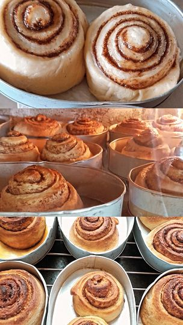

<TagLinks />

# Fluffy Cinnamon Roll

I tested out three recipes, and I have to say, this one makes the absolute best cinnamon rolls I've ever baked!

## Ingredients

DOUGH
- ½ cup fresh milk
- 3 tablespoons butter
- 2 tablespoons oil
- 1 teaspoon vanilla (optional)
- 1 egg
- ¼ cup water
- 2½ cups all purpose flour
- ¼ cup sugar
- 2¼ teaspoons instant yeast
- ½ teaspoon salt

FILLING
- ¼ cup butter soft
- ½ cup brown sugar
- 1 tablespoon cinnamon

GLAZE (optional)
- 1 cup fresh milk
- ½ cup sugar

## Instructions

**Dough:**
1. Mix dry ingredients in a large bowl: 2½ cups all-purpose flour, ¼ cup sugar, 2¼ teaspoons instant yeast, and ½ teaspoon salt.
2. In a small pot, warm ½ cup whole milk and add 3 tablespoons of butter until melted. Mix in 2 tablespoons of oil, 1 teaspoon vanilla extract, ¼ cup water, and 1 egg.
3. Let the milk mixture cool to lukewarm.
4. Create a well in the dry ingredients and pour in the lukewarm milk mixture. Mix by hand or with a stand mixer for about 6-8 minutes until a soft, sticky dough forms.
5. Adjust the dough's consistency by adding 2 tablespoons of flour if too sticky, or 2 tablespoons of water if too thick.
6. Cover the dough with plastic wrap and let it rise for 1½ to 2 hours until it doubles in size.

**Filling:**
1. While the dough rises, mix ⅓ cup brown sugar, 1 tablespoon cinnamon, and a pinch of salt in a small bowl for the filling.
2. After the dough has doubled, roll it into a rectangle using a bit of flour to prevent sticking.
3. Spread ¼ cup softened butter evenly over the dough, then sprinkle the brown sugar and cinnamon mixture.
4. Roll the dough tightly from the long edge closest to you, and pinch the seam to seal.
5. Cut the roll into 8-12 buns using a sharp knife or string.
6. Place the buns in a buttered tin mold or baking pan and cover with plastic. Let them rise for 45-60 minutes until doubled in size.

**Baking:**
1. Preheat your oven to 190°C (375°F).
2. Bake the rolls for 18-22 minutes until they turn golden brown and cook through in the middle.
3. Allow the cinnamon rolls to cool while you make the glaze.

**Glaze:**
1. In a heated pan, combine sugar and milk, stirring consistently until you reach your desired glaze consistency.
2. Pour the glaze over the cooled cinnamon rolls.

## Tools

1. Mixing Bowls
2. Measuring Cups and Spoons
3. Stand Mixer (optional)
4. Rolling Pin
5. Tin Mold or Baking Pan 
6. Sharp Knife or String
7. Cooling Rack
8. Oven

## Tips

Best eaten when hot!!

## Author
Sophia Alabado