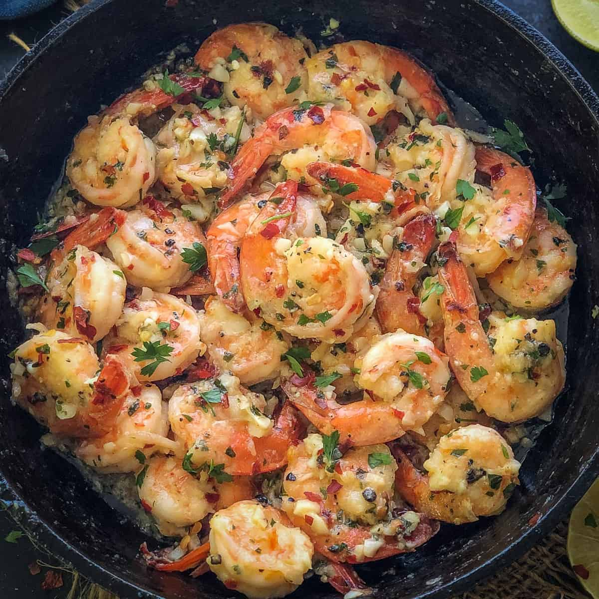

<TagLinks />

# Garlic Buttered Shrimp

If you're craving for seafood, why not try out this recipe? This garlic buttered shrimp is the perfect dish to enjoy on a casual dinner or during special occasions. It's also quick and easy to make, and you can also pair this dish with bread, rice, or garlic toast 😋.

  </img>

## Ingredients

- 8 cloves of garlic
- Diced onions
- 250ml of Sprite Drink (2 tbsp. of sugar can be an alternative)
- 1/2 butter or margarine
- Chopped *siling labuyo*
- 500g of Shrimp
- salt and pepper to taste
- Scallions for garnish (optional)
- Cooking oil

## Instructions

1. Step 1: Wash the shrimps properly with cold water, check for signs of spoliage.
2. Step 2: Add the butter in the pan, let it melt in **low heat**.
3. Step 3: Sauté the onions, garlic, and *siling labuyo*.
4. Step 4: Add the shrimp, sauté for **2 minutes**.
5. Step 5: Slowly pour the **sprite** in the pan, increase to **medium heat**, and let it simmer for **3 minutes**.
6. Step 6: Add **salt**, put a lid on the pan, and let it simmer for **4-6 minutes**.
7. Step 7: You can adjust the taste to your own preference by adding a bit of **salt/sugar**, and if the flavor is too strong you can add a bit of water
8. Step 8: When it is cooked, set on a plate and garnish with scallions. Enjoy! :D

## Tools

- Chopping board
- Knife
- Wooden or plastic spatula
- Iron cast cooking pan or skillet

## Tips

- You can let the dish simmer a bit more so that the flavors will seep into the shrimp. Aside from scallions, you can use fried garlic for garnishing the dish.
- This dish is best when served immediately, and if there are any leftovers it can last up to 2-3 days in the fridge. When it is cooked longer than the recommended time, the shrimp meat's texture can be a bit rubbery.
  
## Author

[Kate Callao](www.linkedin.com/in/kate-callao-687896282)
