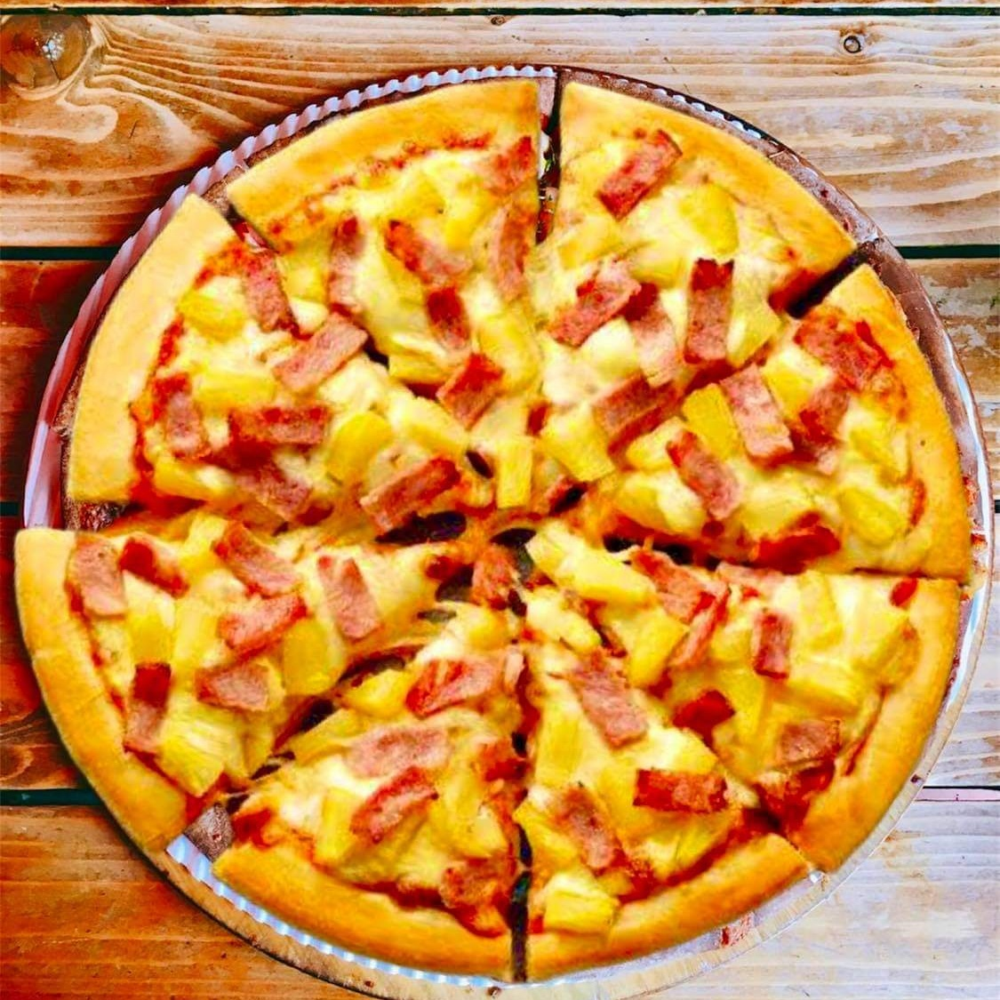

<TagLinks />

# Pizza Dragon

Are you a fan of pizza? or have fast food cravings? and you are a PUP student? This is the way to go!!

  

## Where

Along Teresa Street near PUP
[Pizza Dragon's Location](https://maps.app.goo.gl/dACZjRibR9tvNFPD9)

## Price Range

200 above

## Review

Before formally starting my life as a PUPian, I was looking for a nearby food stall and this is where I decided to eat. It was worth every penny. I have tried their hawaiian pizza and chicken wings, it was one of the pizzas I have tried so far. The prizes are also cheap compared to other pizza stores. If cravings kicked in, this is a perfect place to go. They also have maki and tempura rolls which I'm planning to try in the future. The only downside of this place is it is too small so not a lot of customers can eat. Don't hesitate to try, it is a must!!! Pizza Dragon will really satisfy your pizza desires.

## Rating

4.5 out of 5.0 Stars

## Author

[Christine Julia Alpornon](https://www.facebook.com/jouleaaa/)